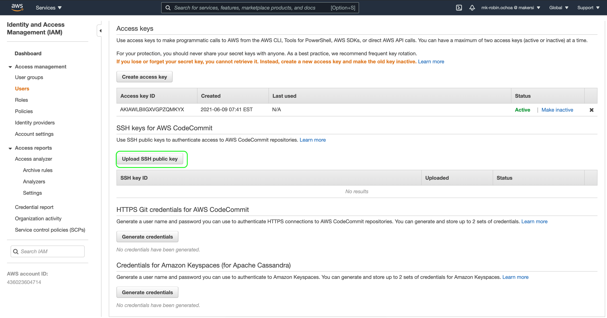

# Video embed


- [works: npm react-player](https://www.npmjs.com/package/react-player)
- [works: example](https://github.com/CookPete/react-player/blob/HEAD/src/demo/App.js)
https://file-examples.com/index.php/sample-video-files/sample-webm-files-download/
https://github.com/CookPete/react-player/tree/076a640ebf9d73c9faff88743edde03f5233ff7b

```sh
yarn add react-player
npm i react-player

```
# Drag
https://www.npmjs.com/package/react-draggable

# React Widgets UI
https://www.codeinwp.com/blog/react-ui-component-libraries-frameworks/
https://blog.logrocket.com/top-10-react-component-libraries-for-2020/
https://blog.logrocket.com/top-7-ui-libraries-and-kits-for-react/

# Starting React App
```sh
source ~/.bash_profile
npx create-react-app kio-sl-lms
```

# Amplify

## configure

- Just when is a new aws account
```sh
amplify configure
```


## init

```sh
amplify init
# Note: It is recommended to run this command from the root of your app directory
# ? Enter a name for the project kio-sl-lms
# ? Enter a name for the environment kilmsenv
# ? Choose your default editor: Visual Studio Code
# ? Choose the type of app that you're building javascript
# Please tell us about your project
# ? What javascript framework are you using react
# ? Source Directory Path:  src
# ? Distribution Directory Path: build
# ? Build Command:  npm run-script build
# ? Start Command: npm run-script start
# Using default provider  awscloudformation


# For more information on AWS Profiles, see:
# https://docs.aws.amazon.com/cli/latest/userguide/cli-multiple-profiles.html

# ? Do you want to use an AWS profile? Yes
# ? Please choose the profile you want to use kio-makersi-sl-lms
# Adding backend environment kilmsenv to AWS Amplify Console app: d1q9t7bgr5y2mv
# ⠴ Initializing project in the cloud...

# CREATE_IN_PROGRESS DeploymentBucket                  AWS::S3::Bucket            Thu Jun 10 2021 08:35:41 GMT-0500 (Colombia Standard Time) Resource creation Initiated
# CREATE_IN_PROGRESS AuthRole                          AWS::IAM::Role             Thu Jun 10 2021 08:35:40 GMT-0500 (Colombia Standard Time) Resource creation Initiated
# CREATE_IN_PROGRESS UnauthRole                        AWS::IAM::Role             Thu Jun 10 2021 08:35:40 GMT-0500 (Colombia Standard Time)                            
# CREATE_IN_PROGRESS DeploymentBucket                  AWS::S3::Bucket            Thu Jun 10 2021 08:35:40 GMT-0500 (Colombia Standard Time)                            
# CREATE_IN_PROGRESS AuthRole                          AWS::IAM::Role             Thu Jun 10 2021 08:35:40 GMT-0500 (Colombia Standard Time)                            
# CREATE_IN_PROGRESS amplify-kio-sl-lms-kilmsenv-83533 AWS::CloudFormation::Stack Thu Jun 10 2021 08:35:36 GMT-0500 (Colombia Standard Time) User Initiated             
# ⠙ Initializing project in the cloud...

# CREATE_IN_PROGRESS UnauthRole AWS::IAM::Role Thu Jun 10 2021 08:35:41 GMT-0500 (Colombia Standard Time) Resource creation Initiated
# ⠼ Initializing project in the cloud...

# CREATE_COMPLETE UnauthRole AWS::IAM::Role Thu Jun 10 2021 08:35:55 GMT-0500 (Colombia Standard Time) 
# CREATE_COMPLETE AuthRole   AWS::IAM::Role Thu Jun 10 2021 08:35:54 GMT-0500 (Colombia Standard Time) 
# ⠴ Initializing project in the cloud...

# CREATE_COMPLETE amplify-kio-sl-lms-kilmsenv-83533 AWS::CloudFormation::Stack Thu Jun 10 2021 08:36:04 GMT-0500 (Colombia Standard Time) 
# CREATE_COMPLETE DeploymentBucket                  AWS::S3::Bucket            Thu Jun 10 2021 08:36:02 GMT-0500 (Colombia Standard Time) 
# ✔ Successfully created initial AWS cloud resources for deployments.
# ✔ Initialized provider successfully.
# Initialized your environment successfully.

# Your project has been successfully initialized and connected to the cloud!

# Some next steps:
# "amplify status" will show you what you've added already and if it's locally configured or deployed
# "amplify add <category>" will allow you to add features like user login or a backend API
# "amplify push" will build all your local backend resources and provision it in the cloud
# “amplify console” to open the Amplify Console and view your project status
# "amplify publish" will build all your local backend and frontend resources (if you have hosting category added) and provision it in the cloud

# Pro tip:
# Try "amplify add api" to create a backend API and then "amplify publish" to deploy everything

```

# Codecommit

[Create repo](https://docs.aws.amazon.com/cli/latest/reference/codecommit/create-repository.html)

```sh
nano ~/.aws/credentials
export PATH=~/Library/Python/3.8/bin:$PATH
# source ~/.bash_profile
# test
aws s3 ls --profile kio-makersi-sl-lms
export AWS_PROFILE=kio-makersi-sl-lms

# aws codecommit create-repository --repository-name MyDemoRepo --repository-description "My demonstration repository" --tags Team=Saanvi
aws codecommit create-repository --repository-name kio-sl-lms --repository-description "Serverless Learning Management System - LMS Software" --tags Team=kio --region us-east-1 

```
## Result
```json
{
    "repositoryMetadata": {
        "accountId": "436023604714",
        "repositoryId": "d1279d41-9a6e-4a39-a3af-a7752aedf7c2",
        "repositoryName": "kio-sl-lms",
        "repositoryDescription": "Serverless Learning Management System - LMS Software",
        "lastModifiedDate": 1623332560.185,
        "creationDate": 1623332560.185,
        "cloneUrlHttp": "https://git-codecommit.us-east-1.amazonaws.com/v1/repos/kio-sl-lms",
        "cloneUrlSsh": "ssh://git-codecommit.us-east-1.amazonaws.com/v1/repos/kio-sl-lms",
        "Arn": "arn:aws:codecommit:us-east-1:436023604714:kio-sl-lms"
    }
}
```

# git

```sh
ssh-keygen
/Users/robin8a/.ssh/kio_sl_lms_rsa

cat ~/.ssh/kio_sl_lms_rsa.pub

```

## Configure AWS IAM user



```sh
cd ~/.ssh
ls
nano config

# Add

# CodeCommit hosts
Host kio_sl_lms_rsa
   HostName git-codecommit.us-east-1.amazonaws.com
   User APKAWLBIIGXVPJ7NHOZ5
   IdentityFile ~/.ssh/kio_sl_lms_rsa

```

https://xiaolishen.medium.com/use-multiple-ssh-keys-for-different-github-accounts-on-the-same-computer-7d7103ca8693

```sh
git remote -v
git remote rm origin
git remote add origin ssh://kio_sl_lms_rsa/v1/repos/kio-sl-lms
git push
```


# Amplify hosting

## Result
```sh
amplify add hosting
# ? Select the plugin module to execute Hosting with Amplify Console (Managed hosting with custom domains, Continuous deployment)
# ? Choose a type Continuous deployment (Git-based deployments)
# ? Continuous deployment is configured in the Amplify Console. Please hit enter once you connect your repository 
# Amplify hosting urls: 
# ┌──────────────┬────────────────────────────────────────────┐
# │ FrontEnd Env │ Domain                                     │
# ├──────────────┼────────────────────────────────────────────┤
# │ main         │ https://main.d27calhvr9nc4h.amplifyapp.com │
# └──────────────┴────────────────────────────────────────────┘
```


# Amplify Personalize

- [Personalized recommendations](https://docs.amplify.aws/lib/analytics/personalize/q/platform/js#working-with-the-api)


# Draggable control image
- [react-draggable-and-resizable-pictures](https://stackblitz.com/edit/react-draggable-and-resizable-pictures)