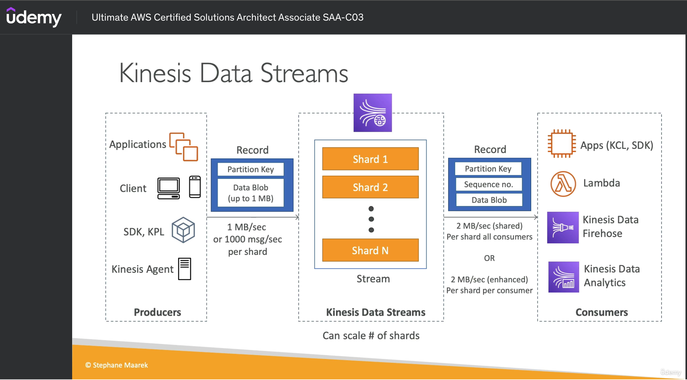
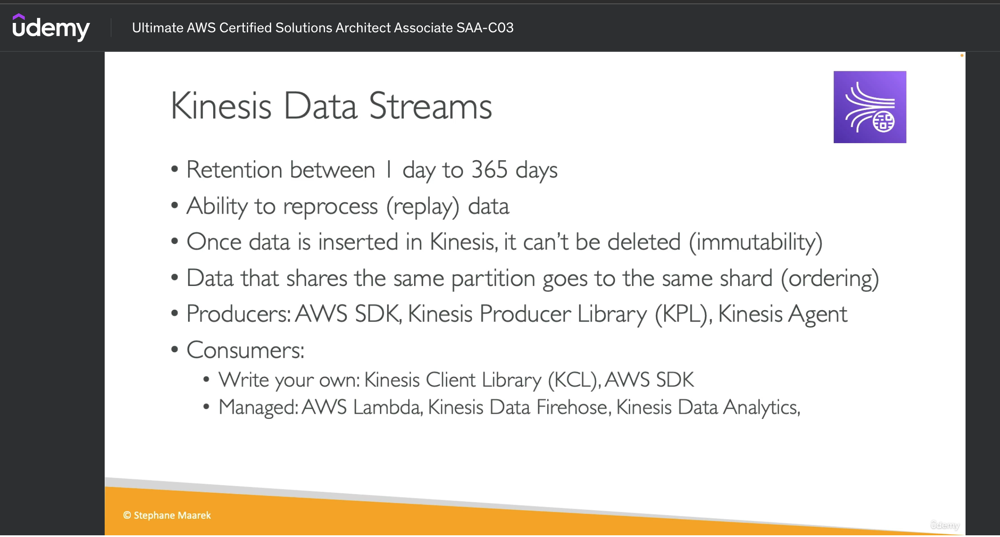
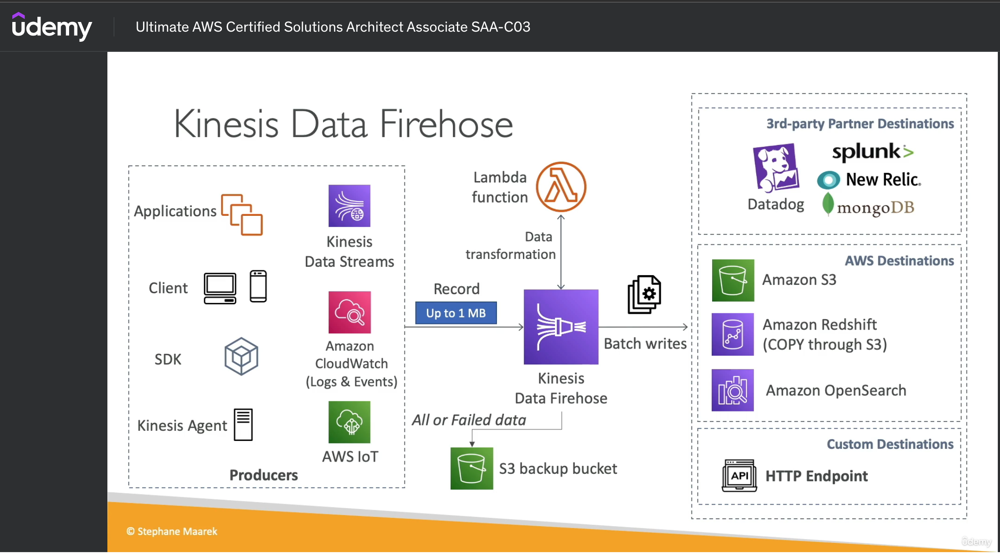

# References
- https://docs.amplify.aws/react/build-a-backend/more-features/analytics/storing-data/
- https://docs.aws.amazon.com/streams/latest/dev/fundamental-stream.html
- https://www.youtube.com/watch?v=xu3A_7DcRgQ
- https://aws.amazon.com/blogs/storage/querying-data-without-servers-or-databases-using-amazon-s3-select/
- https://github.com/SatadruMukherjee/Data-Preprocessing-Models/blob/main/convert_json_to_csv_in_kinesis_firehose_transformation.ipynb

## AWS Invented (good example)
- https://www.youtube.com/watch?v=xu3A_7DcRgQ


## Pricing
- https://aws.amazon.com/kinesis/data-streams/pricing/

## Agregation
- https://docs.aws.amazon.com/AmazonS3/latest/userguide/s3-select-sql-reference-aggregate.html
- https://www.youtube.com/watch?v=xu3A_7DcRgQ

## Kinesis datastream => Firehose => s3 (cvs)
- [How can I convert a JSON to CSV using data transformation (lambda and python) in a Kinesis Firehose?](https://www.youtube.com/watch?v=w0EaPnGNPZA)


# CLI
```sh
aws kinesis list-streams


    "StreamNames": [
        "kiosllmsrjsappKinesis-dev"
    ],
    "StreamSummaries": [
        {
            "StreamName": "kiosllmsrjsappKinesis-dev",
            "StreamARN": "arn:aws:kinesis:us-east-1:036134507423:stream/kiosllmsrjsappKinesis-dev",
            "StreamStatus": "ACTIVE",
            "StreamModeDetails": {
                "StreamMode": "PROVISIONED"
            },
            "StreamCreationTimestamp": "2023-10-31T14:28:09-05:00"
        }
    ]
}

aws kinesis describe-stream-summary --stream-name kiosllmsrjsappKinesis-dev

aws kinesis put-record --stream-name kiosllmsrjsappKinesis-dev --partition-key 123 --data testdata

aws kinesis get-shard-iterator --shard-id shardId-000000000000 --shard-iterator-type TRIM_HORIZON --stream-name kiosllmsrjsappKinesis-dev

{
    "ShardIterator": "AAAAAAAAAAH9kES7x3z2xvoIH2U4jmuXmaiCr95JECYpKRTmlkYOGY0cV0/jf5RCPMFDqGaqNCnb7UBDCEvlA/ISf4E9YAY/EAYpinMB3+5NOyPVQOly75j+0J8RcT7hvTfRafIF1llATxbR0HcPDBiUYxPdPv0r+mm7u4073trNshpNbO6MHVr0wefTRWoSD1a166DOayjws/yAyeDzM+Kn93iFtlHUjrCjWzFovQ26iUX0xpnx8Wq99mtkZ7d2mHpMspoOO9c="
}

aws kinesis get-records --shard-iterator AAAAAAAAAAH9kES7x3z2xvoIH2U4jmuXmaiCr95JECYpKRTmlkYOGY0cV0/jf5RCPMFDqGaqNCnb7UBDCEvlA/ISf4E9YAY/EAYpinMB3+5NOyPVQOly75j+0J8RcT7hvTfRafIF1llATxbR0HcPDBiUYxPdPv0r+mm7u4073trNshpNbO6MHVr0wefTRWoSD1a166DOayjws/yAyeDzM+Kn93iFtlHUjrCjWzFovQ26iUX0xpnx8Wq99mtkZ7d2mHpMspoOO9c=

SHARD_ITERATOR=$(aws kinesis get-shard-iterator --shard-id shardId-000000000000 --shard-iterator-type TRIM_HORIZON --stream-name kiosllmsrjsappKinesis-dev --query 'ShardIterator')

aws kinesis get-records --shard-iterator $SHARD_ITERATOR

```
# AWS S3 SQL query
```sql
SELECT SUM(CAST(_3 as INT)) FROM s3object s WHERE _2 LIKE 'example-folder/%' AND _2 != 'example-folder/';

1:  count_visitor_number
2:  {'sub': 'a951ac69-d27b-4a3f-82ca-004c14926f72'
3: 'email_verified': True
4: 'birthdate': '01/10/1979'
5: 'gender': 'Masculino'
6:  'custom:role': 'Creador de contenido'
7: 'email': 'robin@suan.global'}
8: 1

SELECT SUM(CAST(_8 as INT)) FROM s3object s WHERE _1 LIKE 'count_visitor_number%';
```

# Athena
- kio-sl-lms-rjs-app-kinesis-firehose-csv-notebook
- https://aws.amazon.com/athena/pricing/


# Introduction to Kinesis Firehose

## Producer / Consumers



## Record from Producers
- Partition key: Wich shard is going to be store
- Data Blob (up to 1MB)
- 1 MB/sec or 1000 msg/sec per shard Ex (5 sharda 5 MB/sec or 5000 msg/sec)


## Record from Kinesis Data Streams
- Partition Key
- Sequence No (where the record was in the shard)
- Data blob

## Data Streams
- 
- [Forecast pricing]("https://docs.google.com/spreadsheets/d/14duKJOsznvt8tm4y6_4ewR5xMau8O_uXq8R0DkeC9KE/edit?usp=sharing")

## Modes
- 

# Firehose


# Solution

## Kinesis datastream => Firehose => s3 (cvs)


## Unified 
- https://stackoverflow.com/questions/64687837/aws-lambda-combine-multiple-csv-files-from-s3-into-one-file

SUAN Global

# Data Engineering

## ETL Glue 
### Pricing
- https://aws.amazon.com/glue/pricing/?nc1=h_ls

## Parquet
- Prefered for analytics
- Long storage eficiency

## HDFS (Haadop Distributed File System)
- Dynamic data is not a good solution

## Modelo de programación Map Reduce
- [Map Reduce Tutorial](https://youtu.be/yaeLIiHVPw4?si=mPZ4tspmHZa-6i2d)
[Reducer](./_images/map_reducer.png)

## Apache Spark
[Master/Nodos](./_images/spark.png)
- Framework
- Usa parquet
- https://www.youtube.com/watch?v=B038xGcnaG4
- Procesar grandes de cantidades de datos
- Computación distribuida
- Master
- Nodos
- MapReduce (divide y conquista)

### ML
- MLib
- GraphX analisis de grafos


# Builder.io to react


# Figma to React 
- [Visual Copilot Converts Figma Mocks to React Fast and Accurately](https://www.youtube.com/watch?v=DttZuqAiuR0)