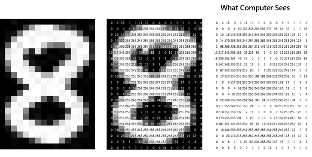
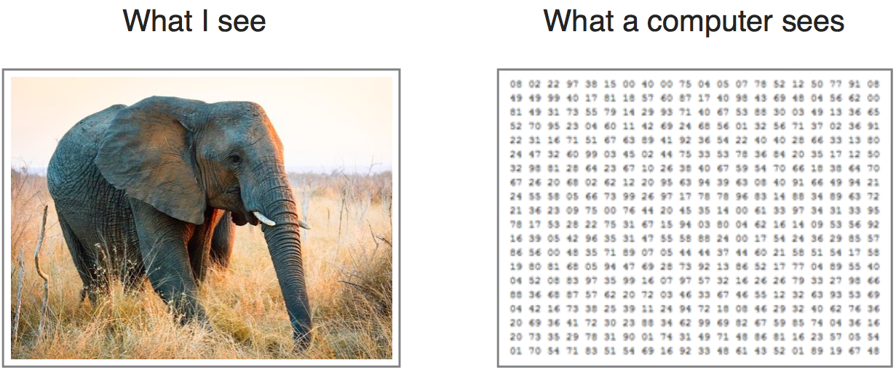
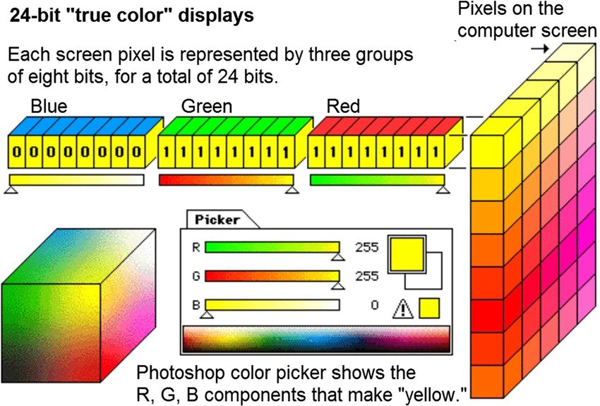
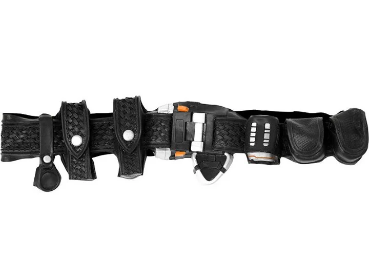

# Introducción
Visión computarizada es el campo de estudio que se  enfoca en habilitar el entendimiento e interpretar información visual del mundo real, que involucra el desarrollo de algoritmos y técnicas para extraer información relevante de imágenes o videos.

# Que vén los computadores?
Una computadora "ve" a través de sus diversos dispositivos de entrada, como cámaras, sensores o escáneres, según su configuración y propósito. Estos dispositivos capturan datos del entorno circundante en forma de señales o datos digitales. Por ejemplo:

1. **Cámaras**: Las cámaras digitales capturan imágenes y videos, convirtiendo la información de la luz en datos digitales que pueden ser procesados por la computadora.

2. **Sensores**: Los sensores pueden detectar diversos factores ambientales como temperatura, presión, movimiento o proximidad. Proporcionan datos a la computadora sobre el mundo físico.

3. **Escáneres**: Los escáneres convierten documentos físicos o imágenes en datos digitales analizando los patrones de luz reflejados en la superficie.

Una vez capturados los datos, la computadora los procesa utilizando algoritmos y software para interpretar y comprender la información. Esta interpretación podría implicar tareas como reconocimiento de objetos, clasificación de imágenes, seguimiento de movimiento o cualquier otro análisis relevante según la aplicación y el tipo de datos que se procesen.

## Cámaras
> Los computadores a través de imágnes digitalizadas, ven una matriz de pixeles donde cada uno tiene un valor que depende del sistema que se esté usando por ejemplo RGB (red, green and blue) 

# Cinturon de herramientas

## Python
> Python es un lenguaje de alto nivel de programación interpretado cuya filosofía hace hincapié en la legibilidad de su código, se utiliza para desarrollar aplicaciones de todo tipo, por ejemplo: Instagram, Netflix, Spotify, Panda3D, entre otros.​ Wikipedia

## Jupyter
> El Proyecto Jupyter es una organización sin ánimo de lucro creada para "desarrollar software de código abierto, estándares abiertos y servicios para computación interactiva en docenas de lenguajes de programación [Fuente: Wikipedia][https://es.wikipedia.org/wiki/Proyecto_Jupyter]
- [Jupyter Notebook: An Introduction](https://realpython.com/jupyter-notebook-introduction/)

## Markdown:
> Markdown es un lenguaje de marcado ligero creado por John Gruber y Aaron Swartz que trata de conseguir la máxima legibilidad y facilidad de publicación tanto en su forma de entrada como de salida, inspirándose en muchas convenciones existentes para marcar mensajes de correo electrónico usando texto plano. [Fuente: Wikipedia][https://en.wikipedia.org/wiki/Markdown]
- [Guía inicial](https://colab.research.google.com/notebooks/markdown_guide.ipynb)

## Google Colab
> Colab es un servicio alojado de Jupyter Notebook que no requiere configuración para su uso y proporciona acceso gratuito a recursos informáticos, incluidas GPU y TPU. Colab es especialmente adecuado para el aprendizaje automático, la ciencia de datos y la educación. [Colab](https://colab.google/)
- [Descripción general](https://colab.research.google.com/notebooks/basic_features_overview.ipynb)
- [Iniciando con Google Colab](https://colab.research.google.com/?utm_source=scs-index#scrollTo=qB3bdLe8jkAa)
- [Aprovecha al máximo Colab](https://colab.research.google.com/#scrollTo=qB3bdLe8jkAa)
- [Original: ](https://colab.research.google.com/)

## Raspberry Pi

## Roboflow

## AWS Rekognition

## AWS Sagemaker

# Operaciones básicas 
Para evitar el sobreajuste y crear un conjunto de datos más grande a partir de uno más pequeño, podemos utilizar una técnica llamada aumento de datos. Esto consiste simplemente en realizar transformaciones aleatorias en nuestras imágenes para que nuestro modelo pueda generalizarse mejor. Estas transformaciones pueden ser cosas como compresiones, rotaciones, estiramientos e incluso cambios de color.

1. Escalamiento
2. Voltear
3. Brillo
4. Operaciones bitwise 
5. Desenfocar, afilar

[0011_Image_Processing_in_Python_.ipynb](https://colab.research.google.com/drive/1O3GSNdPmqVRu6uB9XatjqHFCVZb-bVAR)

# Operaciones avanzadas
1. Ecualización de histograma
2. Transformación en escala de grises y ecualización de histograma
3. Transformada de Fourier de imágenes grises
4. Encontrar bordes mediante filtrado de paso alto en FFT

[0012_Image_Processing_in_Python.ipynb](https://colab.research.google.com/drive/1T1XuwrtMdvDNJneRXOLoVmrBcTAiJs68?usp=sharing)

# Algoritmos y aplicaciones (CV)
A continuación alguna de las aplicaciones:

- Extracción de características, 
- Detección de objetos
- Segmentación de imágenes, 
- Mejora de imágenes
- Detección y seguimiento de movimiento etc.

## Detección de Bordes (Edge detection)
La detección de bordes en visión por computadora es un proceso fundamental e inicial que se utiliza para identificar límites dentro de las imágenes. El objetivo de la detección de bordes es localizar los puntos de una imagen donde hay un cambio significativo de intensidad o color. Estos puntos suelen corresponder a los límites entre diferentes objetos o regiones dentro de la imagen.

## Segmentación

> Imagina que tienes un dibujo con muchos colores, como un dibujo para colorear. Ahora, ¿alguna vez has querido pintar dentro de las líneas pero no sabías dónde empezar o terminar? Bueno, la segmentación de imágenes es un poco como eso, ¡pero en la computadora!

> Piensa en una foto que tomaste con tu cámara. ¿Has notado que hay diferentes partes en la imagen? Algunas partes pueden ser el cielo, otras pueden ser árboles, personas, o el suelo. La segmentación de imágenes es como dividir la imagen en partes, como si estuviéramos pintando dentro de las líneas, pero con la ayuda de la computadora.

> Ahora, ¿cómo sabe la computadora dónde están las líneas? Bueno, imagina que estás usando un lápiz mágico que puede ver los bordes de las cosas. Cuando pasas el lápiz mágico sobre la imagen, detecta dónde hay cambios grandes, como donde el cielo se encuentra con los árboles, o donde las personas están paradas en el suelo. Estos son los bordes, y la computadora los usa para dividir la imagen en partes.

> Entonces, la segmentación de imágenes es como si la computadora usara un lápiz mágico para encontrar las líneas importantes en una imagen y luego dividirla en partes para que podamos entenderla mejor. Es una forma genial en que la computadora nos ayuda a entender las fotos y las imágenes que vemos en la pantalla. ¡Es como si la computadora tuviera su propio juego de colorear, pero con imágenes en lugar de papel!

- [Segment Anything Model (SAM)](https://colab.research.google.com/drive/1TRhFRkGdoMCMvgbx5hRT1H3oFgmOpWzD?usp=sharing)

## Detección puntos clave
> Imagina que tienes un mapa de un tesoro. En lugar de buscar todo el mapa, ¿qué tal si solo buscas lugares especiales que te indiquen dónde puede estar el tesoro? Estos lugares especiales podrían ser montañas altas, cruces de caminos o árboles gigantes. En la detección de puntos clave, la computadora busca estos "lugares especiales" en una imagen.

> Ahora, ¿cómo sabe la computadora cuáles son estos lugares especiales? Bueno, imagina que tienes una lupa mágica que puede ver detalles muy pequeños. Cuando pasas esta lupa sobre la imagen, te muestra los lugares donde hay muchos cambios o detalles interesantes. Estos son los puntos clave, como las montañas altas o los árboles gigantes en nuestro mapa del tesoro.

> Una vez que la computadora encuentra estos puntos clave, puede usarlos para hacer cosas interesantes, como comparar imágenes y ver si son similares o encontrar objetos en una imagen. Es como si la computadora estuviera buscando tesoros en una imagen y luego usara esos tesoros para hacer cosas asombrosas, ¡como encontrar objetos o reconocer lugares! Es una forma muy útil en la que la computadora nos ayuda a entender y trabajar con imágenes.

## Extracción de características

[0013_Image_Aplications_Python.ipynb](https://colab.research.google.com/drive/1rY48Y5BGotO0dDlN9ZmnCIhMlOX5wP91?usp=sharing)

# Aplicaciones en el mundo real
- Reconocimiento de objetos
- Clasificación de imágenes
- Seguimiento de objetos
- Analisis de video
- Detección de rostros
- Robotics
- Biología y medicina
- Conducción automática

# Google Colab
## Librerias

- Numpy es una biblioteca de manipulación de matrices, utilizada para álgebra lineal, transformada de Fourier y capacidades de números aleatorios. [Tutorial](https://colab.research.google.com/github/google/eng-edu/blob/main/ml/cc/exercises/numpy_ultraquick_tutorial.ipynb?utm_source=mlcc&utm_campaign=colab-external&utm_medium=referral&utm_content=numpy_tf2-colab&hl=en)

- Pandas es una biblioteca para la manipulación y el análisis de datos. [Tutorial](https://colab.research.google.com/github/google/eng-edu/blob/main/ml/cc/exercises/pandas_dataframe_ultraquick_tutorial.ipynb?utm_source=mlcc&utm_campaign=colab-external&utm_medium=referral&utm_content=pandas_tf2-colab&hl=en)

- CV2 es una biblioteca para tareas de visión artificial. [Open CV Fundamentals ](https://colab.research.google.com/github/computationalcore/introduction-to-opencv/blob/master/notebooks/1-Fundamentals.ipynb)

NumPy UltraQuick Tutorial Colab exercise, which provides all the NumPy information you need for this course.
pandas UltraQuick Tutorial Colab exercise, which provides all the pandas information you need for this course.
# Raspberry Pi

# Roboflow

